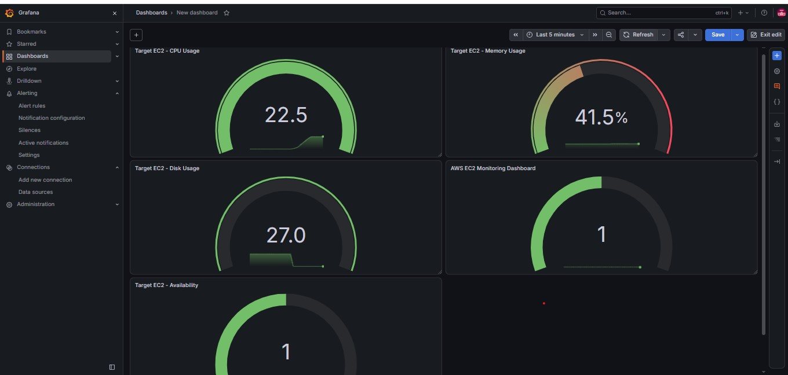

## Grafana Dashboard



# AWS EC2 Monitoring with Prometheus and Grafana

## Project Overview

This project provisions AWS infrastructure using Terraform and monitors an EC2 server using Prometheus, Node Exporter, and Grafana.

The infrastructure is deployed in the AWS Mumbai region (`ap-south-1`). Prometheus collects metrics from Node Exporter running on the target EC2 instance, and Grafana visualizes the collected metrics in a dashboard.

## Architecture

- **Terraform** provisions and manages the AWS infrastructure.
- **Amazon VPC** provides the isolated network.
- **Public subnet** hosts both EC2 instances.
- **Internet Gateway and route table** provide internet connectivity.
- **Security Groups** restrict access to the servers and monitoring ports.
- **EC2 Monitoring Server** runs Prometheus and Grafana.
- **EC2 Target Server** runs Prometheus Node Exporter.
- **Prometheus** collects and stores time-series metrics.
- **Grafana** displays monitoring data in dashboards.

All monitoring services are installed directly on Ubuntu. Docker is not used.

## AWS Infrastructure

| Resource | Configuration |
|---|---|
| Region | ap-south-1 (Mumbai) |
| VPC CIDR | 10.20.0.0/16 |
| Public subnet CIDR | 10.20.1.0/24 |
| Monitoring instance | t3.small |
| Target instance | t3.micro |
| Monitoring storage | 12 GB gp3 |
| Target storage | 8 GB gp3 |
| Operating system | Ubuntu 22.04 LTS |
| Infrastructure as Code | Terraform |

Both instances are in the public subnet. Their public IP addresses are assigned by AWS and may change if the instances are replaced.

## Monitoring Dashboard

The Grafana dashboard includes:

- Target EC2 CPU utilization
- Target EC2 memory utilization
- Target EC2 disk utilization
- Target EC2 availability

Prometheus scrapes Node Exporter at port 9100 over the VPC network.

The target availability query is:

```promql
up{job="node", instance="10.20.1.190:9100"}
